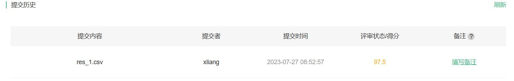

# 暑期DL学习week3-xliang

## 1.代码练习之猫狗大战

### LeNet

数据集来源：https://god.yanxishe.com/41
代码如下：

```python
import numpy as np
import matplotlib.pyplot as plt
import torch
import torch.nn as nn
import torchvision
from torchvision import models,transforms,datasets
import torch.nn.functional as F
from PIL import Image
import torch.optim as optim
import json, random
import os

device = torch.device("cuda:0" if torch.cuda.is_available() else "cpu")
infos = torch.cuda.get_device_properties(0)
print(infos)

# 训练图片和测试图片的路径
# 训练集2万张图片太多，选取了猫狗各2500张图片
train_path = './cat_dog/train_1/'
test_path = './cat_dog/test/'

def get_data(file_path):
    #获得文件名称
    file_lst = os.listdir(file_path)
    data_lst = []
    for i in range(len(file_lst)):
        #提取图片标签
        clas = file_lst[i][:3]
        #获取图片路径
        img_path = os.path.join(file_path,file_lst[i])
        if clas == 'cat':
            data_lst.append((img_path, 0))
        else:
            data_lst.append((img_path, 1))
    return data_lst

class catdog_dataset(torch.utils.data.Dataset):
    def __init__(self, path, transform):
        super(catdog_dataset).__init__()
        self.data_lst = get_data(path)
        self.trans = torchvision.transforms.Compose(transform)
    def __len__(self):
        return len(self.data_lst)
    def __getitem__(self,index):
        (img,cls) = self.data_lst[index]
        image = self.trans(Image.open(img))
        label = torch.tensor(cls,dtype=torch.float32)
        return image,label

train_loader = torch.utils.data.DataLoader(
    catdog_dataset(train_path,
    [transforms.Resize((128,128)),transforms.ToTensor()]),
    batch_size=128,
    shuffle=True)

class Net(nn.Module):
    def __init__(self):
        super(Net, self).__init__()
        self.conv1 = nn.Conv2d(3, 6, 5)
        self.pool = nn.MaxPool2d(2, 2)
        self.conv2 = nn.Conv2d(6, 16, 5)
        self.pool = nn.MaxPool2d(2, 2)
        self.conv3 = nn.Conv2d(16, 32, 4)
        self.conv4 = nn.Conv2d(32, 32, 4)
        self.conv5 = nn.Conv2d(32, 64, 5)
        self.pool = nn.MaxPool2d(2, 2)
        self.fc1 = nn.Linear(64, 16)
        self.fc2 = nn.Linear(16, 2)

    def forward(self, x):
        x = self.pool(F.relu(self.conv1(x)))
        x = self.pool(F.relu(self.conv2(x)))
        x = self.pool(F.relu(self.conv3(x)))
        x = self.pool(F.relu(self.conv4(x)))
        x = F.relu(self.conv5(x))
        x = x.view(-1, 64)
        x = F.relu(self.fc1(x))
        x = F.softmax(self.fc2(x), dim=1)
        return x

net = Net().to(device)
criterion = nn.CrossEntropyLoss()
optimizer = optim.Adam(net.parameters(), lr=0.0001)

for epoch in range(30):  
    for i, (inputs, labels) in enumerate(train_loader):
        inputs = inputs.to(device)
        labels = labels.to(device)
        # 优化器梯度归零
        optimizer.zero_grad()
        # 正向传播 +　反向传播 + 优化
        outputs = net(inputs)
        loss = criterion(outputs, labels.long())
        loss.backward()
        optimizer.step()
    print('Epoch: %d loss: %.6f' %(epoch + 1, loss.item()))
print('Finished Training')

resfile = open('res.csv', 'w')
for i in range(0,2000):
    img_PIL = Image.open('./cat_dog/test/'+str(i)+'.jpg')
    img_tensor = transforms.Compose([transforms.Resize((128,128)),transforms.ToTensor()])(img_PIL)
    img_tensor = img_tensor.reshape(-1, img_tensor.shape[0], img_tensor.shape[1], img_tensor.shape[2])
    img_tensor = img_tensor.to(device)
    out = net(img_tensor).cpu().detach().numpy()
    if out[0, 0] < out[0, 1]:
        resfile.write(str(i)+','+str(1)+'\n')
    else:
        resfile.write(str(i)+','+str(0)+'\n')
resfile.close()
```

训练30epoch后最终得分：


### ResNet

ResNet是华人杰出人工智能科学家何恺明所提出，当时斩获包括ImageNet Classification在内的五项第一，并获得CVPR最佳论文奖。

ResNet解决了传统神经网络随着深度增大随之而来的梯度消失和梯度爆炸问题，所谓梯度消失即参数如果小于1，在网络的传递过程中逐渐趋近于0的问题，梯度爆炸则相反。

ResNet的残差结构图示如下：


个人对残差结构的理解就是在输入端进行路径分支，前者路径进行正常的卷积激活操作，后者路径直接与前者路径的结果进行算术相加后再进行激活输出传递给下一层。如果后者路径上的输入长宽与前者路径不一致则在后者路径上需要1*1的卷积核设置步长为2来进行降维操作。

使用ResNet18在猫狗大战数据集进行训练代码如下

model.py

```python
import torch.nn as nn
import torch


class BasicBlock(nn.Module):
    expansion = 1

    def __init__(self, in_channel, out_channel, stride=1, downsample=None, **kwargs):
        super(BasicBlock, self).__init__()
        self.conv1 = nn.Conv2d(in_channels=in_channel, out_channels=out_channel,
                               kernel_size=3, stride=stride, padding=1, bias=False)
        self.bn1 = nn.BatchNorm2d(out_channel)
        self.relu = nn.ReLU()
        self.conv2 = nn.Conv2d(in_channels=out_channel, out_channels=out_channel,
                               kernel_size=3, stride=1, padding=1, bias=False)
        self.bn2 = nn.BatchNorm2d(out_channel)
        self.downsample = downsample

    def forward(self, x):
        identity = x
        if self.downsample is not None:
            identity = self.downsample(x)

        out = self.conv1(x)
        out = self.bn1(out)
        out = self.relu(out)

        out = self.conv2(out)
        out = self.bn2(out)

        out += identity
        out = self.relu(out)

        return out


class Bottleneck(nn.Module):
    expansion = 4

    def __init__(self, in_channel, out_channel, stride=1, downsample=None,
                 groups=1, width_per_group=64):
        super(Bottleneck, self).__init__()

        width = int(out_channel * (width_per_group / 64.)) * groups

        self.conv1 = nn.Conv2d(in_channels=in_channel, out_channels=width,
                               kernel_size=1, stride=1, bias=False)  # squeeze channels
        self.bn1 = nn.BatchNorm2d(width)
        # -----------------------------------------
        self.conv2 = nn.Conv2d(in_channels=width, out_channels=width, groups=groups,
                               kernel_size=3, stride=stride, bias=False, padding=1)
        self.bn2 = nn.BatchNorm2d(width)
        # -----------------------------------------
        self.conv3 = nn.Conv2d(in_channels=width, out_channels=out_channel*self.expansion,
                               kernel_size=1, stride=1, bias=False)  # unsqueeze channels
        self.bn3 = nn.BatchNorm2d(out_channel*self.expansion)
        self.relu = nn.ReLU(inplace=True)
        self.downsample = downsample

    def forward(self, x):
        identity = x
        if self.downsample is not None:
            identity = self.downsample(x)

        out = self.conv1(x)
        out = self.bn1(out)
        out = self.relu(out)

        out = self.conv2(out)
        out = self.bn2(out)
        out = self.relu(out)

        out = self.conv3(out)
        out = self.bn3(out)

        out += identity
        out = self.relu(out)

        return out


class ResNet(nn.Module):

    def __init__(self,
                 block,
                 blocks_num,
                 num_classes=1000,
                 include_top=True,
                 groups=1,
                 width_per_group=64):
        super(ResNet, self).__init__()
        self.include_top = include_top
        self.in_channel = 64

        self.groups = groups
        self.width_per_group = width_per_group

        self.conv1 = nn.Conv2d(3, self.in_channel, kernel_size=7, stride=2,
                               padding=3, bias=False)
        self.bn1 = nn.BatchNorm2d(self.in_channel)
        self.relu = nn.ReLU(inplace=True)
        self.maxpool = nn.MaxPool2d(kernel_size=3, stride=2, padding=1)
        self.layer1 = self._make_layer(block, 64, blocks_num[0])
        self.layer2 = self._make_layer(block, 128, blocks_num[1], stride=2)
        self.layer3 = self._make_layer(block, 256, blocks_num[2], stride=2)
        self.layer4 = self._make_layer(block, 512, blocks_num[3], stride=2)
        if self.include_top:
            self.avgpool = nn.AdaptiveAvgPool2d((1, 1))  # output size = (1, 1)
            self.fc = nn.Linear(512 * block.expansion, num_classes)

        for m in self.modules():
            if isinstance(m, nn.Conv2d):
                nn.init.kaiming_normal_(m.weight, mode='fan_out', nonlinearity='relu')

    def _make_layer(self, block, channel, block_num, stride=1):
        downsample = None
        if stride != 1 or self.in_channel != channel * block.expansion:
            downsample = nn.Sequential(
                nn.Conv2d(self.in_channel, channel * block.expansion, kernel_size=1, stride=stride, bias=False),
                nn.BatchNorm2d(channel * block.expansion))

        layers = []
        layers.append(block(self.in_channel,
                            channel,
                            downsample=downsample,
                            stride=stride,
                            groups=self.groups,
                            width_per_group=self.width_per_group))
        self.in_channel = channel * block.expansion

        for _ in range(1, block_num):
            layers.append(block(self.in_channel,
                                channel,
                                groups=self.groups,
                                width_per_group=self.width_per_group))

        return nn.Sequential(*layers)

    def forward(self, x):
        x = self.conv1(x)
        x = self.bn1(x)
        x = self.relu(x)
        x = self.maxpool(x)

        x = self.layer1(x)
        x = self.layer2(x)
        x = self.layer3(x)
        x = self.layer4(x)

        if self.include_top:
            x = self.avgpool(x)
            x = torch.flatten(x, 1)
            x = self.fc(x)

        return x

def resnet18(num_classes=1000,include_top=True):
    return ResNet(BasicBlock, [2, 2, 2, 2], num_classes=num_classes, include_top=include_top)

```

train.py

```python
import os
import sys
import json
import torchvision
import torch
import torch.nn as nn
import torch.optim as optim
from torchvision import transforms, datasets
from tqdm import tqdm
from PIL import Image
from model import resnet18


def get_data(file_path):
    #获得文件名称
    file_lst = os.listdir(file_path)
    data_lst = []
    for i in range(len(file_lst)):
        #提取图片标签
        clas = file_lst[i][:3]
        #获取图片路径
        img_path = os.path.join(file_path,file_lst[i])
        if clas == 'cat':
            data_lst.append((img_path, 0))
        else:
            data_lst.append((img_path, 1))
    return data_lst

class catdog_dataset(torch.utils.data.Dataset):
    def __init__(self, path, transform):
        super(catdog_dataset).__init__()
        self.data_lst = get_data(path)
        self.trans = torchvision.transforms.Compose(transform)
    def __len__(self):
        return len(self.data_lst)
    def __getitem__(self,index):
        (img,cls) = self.data_lst[index]
        image = self.trans(Image.open(img))
        label = torch.tensor(cls,dtype=torch.float32)
        return image,label


def main():
    device = torch.device("cuda:0" if torch.cuda.is_available() else "cpu")
    print("using {} device.".format(device))

    train_path = './cat_dog/train/'
    test_path = './cat_dog/val/'

    train_loader = torch.utils.data.DataLoader(
        catdog_dataset(train_path,
                       [transforms.Resize((128,128)),transforms.ToTensor()]),
        batch_size=16,
        num_workers=0,
        shuffle=True)

    validate_loader=torch.utils.data.DataLoader(
        catdog_dataset(test_path,
                       [transforms.Resize((128,128)),transforms.ToTensor()]),
        batch_size=16,
        num_workers=0,
        shuffle=False)
    val_num = 2000


    net = resnet18()
    # load pretrain weights
    model_weight_path = "./model/resnet18-5c106cde.pth"
    assert os.path.exists(model_weight_path), "file {} does not exist.".format(model_weight_path)
    net.load_state_dict(torch.load(model_weight_path, map_location='cpu'))

    # change fc layer structure
    in_channel = net.fc.in_features
    net.fc = nn.Linear(in_channel, 2)
    net.to(device)

    # define loss function
    loss_function = nn.CrossEntropyLoss()

    # construct an optimizer
    params = [p for p in net.parameters() if p.requires_grad]
    optimizer = optim.Adam(params, lr=0.0001)

    epochs = 10
    best_acc = 0.0
    save_path = './resNet18.pth'
    train_steps = len(train_loader)
    for epoch in range(epochs):
        # train
        net.train()
        running_loss = 0.0
        train_bar = tqdm(train_loader, file=sys.stdout)
        for step, data in enumerate(train_bar):
            images, labels = data
            optimizer.zero_grad()
            logits = net(images.to(device))
            loss = loss_function(logits, labels.to(device).long())
            loss.backward()
            optimizer.step()

            # print statistics
            running_loss += loss.item()

            train_bar.desc = "train epoch[{}/{}] loss:{:.3f}".format(epoch + 1,
                                                                     epochs,
                                                                     loss)

        # validate
        net.eval()
        acc = 0.0  # accumulate accurate number / epoch
        with torch.no_grad():
            val_bar = tqdm(validate_loader, file=sys.stdout)
            for val_data in val_bar:
                val_images, val_labels = val_data
                outputs = net(val_images.to(device))
                # loss = loss_function(outputs, test_labels)
                predict_y = torch.max(outputs, dim=1)[1]
                acc += torch.eq(predict_y, val_labels.to(device).long()).sum().item()

                val_bar.desc = "valid epoch[{}/{}]".format(epoch + 1,
                                                           epochs)

        val_accurate = acc / val_num
        print('[epoch %d] train_loss: %.3f  val_accuracy: %.3f' %
              (epoch + 1, running_loss / train_steps, val_accurate))

        if val_accurate > best_acc:
            best_acc = val_accurate
            torch.save(net.state_dict(), save_path)

    print('Finished Training')

    resfile = open('res_1.csv', 'w')
    for i in range(0,2000):
        img_PIL = Image.open('./cat_dog/test/'+str(i)+'.jpg')
        img_tensor = transforms.Compose([transforms.Resize((128,128)),transforms.ToTensor()])(img_PIL)
        img_tensor = img_tensor.reshape(-1, img_tensor.shape[0], img_tensor.shape[1], img_tensor.shape[2])
        img_tensor = img_tensor.to(device)
        out = net(img_tensor).cpu().detach().numpy()
        if out[0, 0] < out[0, 1]:
            resfile.write(str(i)+','+str(1)+'\n')
        else:
            resfile.write(str(i)+','+str(0)+'\n')
    resfile.close()

if __name__ == '__main__':
    main()
```

训练10epoch后的结构与实时得分:




## 2.问题总结

1. **Residual learning 的基本原理？**

   残差学习的思想就是将网络学习的映射从X到F(X)转为学习从X到F(X)-X的差，然后把学习到的残差信息加到原来的输出上即可。这样即使在某些极端情况下，学习到的残差为0，那么网络就退化到传统网络X到F(X)的恒等映射。

2. **Batch Normailization 的原理，思考 BN、LN、IN 的主要区别。**

   BN就是通过一定的规范化手段，将每层网络的输入值较为分散的分布拉回到均值为0方差为1的标准正态分布。这样使得激活输入值落在非线性函数对输入比较敏感的区域，这样输入的小变化就会导致损失函数较大的变化，意思是这样让梯度变大，避免梯度消失，同时加快训练速度。

   BN是在同一batch上对N个特征图的高和宽做归一化；

   LN是在某一通道上对特征图的通道、高和宽做归一化；

   IN是图像像素上对高和宽做归一化。

3. **为什么分组卷积可以提升准确率？即然分组卷积可以提升准确率，同时还能降低计算量，分数数量尽量多不行吗？**

   将特征图分给多个GPU分别处理最后再进行融合可以极大的减少参数，增加卷积核之前的对角相关性。

   分组数需要合适，因为组间信息不能互通，无法交流学习。如果特征图的像素具有局部相关性，分组卷积学习可能无法利用局部信息进行学习。


